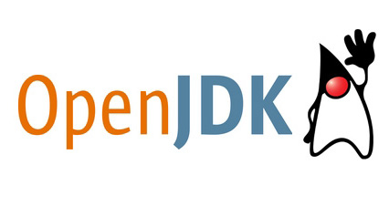

# Workshop

# Maven 
</img>
```bash
$ mvn spring-boot:run
```

# Java runtime
</img>
## Compilar
```bash
$ mvn clean package
```

## Ejecución
```bash
$ java -jar target/jpa-rest-0.0.1-SNAPSHOT.jar
```

# Docker runtime
</img>
## Compilado
```bash
$ mvn clean package docker:build
...
Successfully built 86d387a5ef13
Successfully tagged com.dbg.uca/jpa-rest:latest
[INFO] Built com.dbg.uca/jpa-rest
[INFO] Tagging com.dbg.uca/jpa-rest with 0.0.1-SNAPSHOT
[INFO] Tagging com.dbg.uca/jpa-rest with latest
[INFO] ------------------------------------------------------------------------
[INFO] BUILD SUCCESS
[INFO] ------------------------------------------------------------------------
[INFO] Total time:  19.782 s
```

## Ejecución
```bash
$ docker run -p 8080:8080 --name uca -d com.dbg.uca/jpa-rest
$ http :8080
  HTTP/1.1 200 
  Content-Type: application/hal+json
  Date: Mon, 02 Dec 2019 17:53:14 GMT
  Transfer-Encoding: chunked
  Vary: Origin
  Vary: Access-Control-Request-Method
  Vary: Access-Control-Request-Headers
  
  {
      "_links": {
          "characters": {
              "href": "http://localhost:8080/characters{?page,size,sort}",
              "templated": true
          },
          "profile": {
              "href": "http://localhost:8080/profile"
          }
      }
  }
```

## Parar Docker
```bash
$ docker kill uca
$ docker rm uca
```

# Docker-compose
</img>
## Start
```bash
$ docker-compose up -d
Creating network "uca-1219_default" with the default driver
Creating uca-1219_mariadb_1 ... done
Creating uca-1219_ms-jpa-rest_1 ... done
```
## Logs
```bash
$ docker-compose logs -f
```
## Restart a service
```bash
$ docker-compose restart ms-jpa-rest
Restarting uca-1219_ms-jpa-rest_1 ... done
```

## Delete stack
```bash
$ docker-compose down
```

# Kubernetes
</img>
## Minikube

### start
```bash
$ minikube start 
🙄  minikube v1.4.0 on Ubuntu 18.04
🔥  Creating virtualbox VM (CPUs=8, Memory=8096MB, Disk=20000MB) ...
🐳  Preparing Kubernetes v1.15.4 on Docker 18.09.9 ...
🚜  Pulling images ...
🚀  Launching Kubernetes ... 
    Waiting for: apiserver proxy etcd scheduler controller dns
🏄  Done! kubectl is now configured to use "minikube"
```
### init helm
```bash
$ helm init
```

### deploy the chart
```bash
$ helm install --name jpa-rest kubernetes/
NAME:   jpa-rest
LAST DEPLOYED: Mon Dec  2 23:03:52 2019
NAMESPACE: default
STATUS: DEPLOYED

RESOURCES:
==> v1/Service
NAME              TYPE       CLUSTER-IP      EXTERNAL-IP  PORT(S)   AGE
jpa-rest-mariadb  ClusterIP  10.111.138.157  <none>       3306/TCP  0s
ms-jpa-rest       ClusterIP  10.110.47.247   <none>       80/TCP    0s

==> v1/Deployment
NAME         DESIRED  CURRENT  UP-TO-DATE  AVAILABLE  AGE
ms-jpa-rest  5        5        5           0          0s

==> v1beta1/StatefulSet
NAME              DESIRED  CURRENT  AGE
jpa-rest-mariadb  1        1        0s

==> v1/Pod(related)
NAME                          READY  STATUS   RESTARTS  AGE
ms-jpa-rest-76879b89c4-856s5  0/1    Pending  0         0s
ms-jpa-rest-76879b89c4-8ts8v  0/1    Pending  0         0s
ms-jpa-rest-76879b89c4-pk2db  0/1    Pending  0         0s
ms-jpa-rest-76879b89c4-rm4cf  0/1    Pending  0         0s
ms-jpa-rest-76879b89c4-vwbtm  0/1    Pending  0         0s
jpa-rest-mariadb-0            0/1    Pending  0         0s

==> v1/Secret
NAME            TYPE    DATA  AGE
secret-mariadb  Opaque  4     0s

==> v1/ConfigMap
NAME                    DATA  AGE
jpa-rest-mariadb        1     0s
jpa-rest-mariadb-tests  1     0s


NOTES:
1. Get the application URL by running these commands:
  export POD_NAME=$(kubectl get pods --namespace default -l "app.kubernetes.io/name=ms-jpa-rest,app.kubernetes.io/instance=jpa-rest" -o jsonpath="{.items[0].metadata.name}")
  echo "Visit http://127.0.0.1:8080 to use your application"
  kubectl port-forward $POD_NAME 8080:80
```

### delete the chart
```bash
$ helm delete --purge jpa-rest
release "jpa-rest" deleted
```

### stop minikube
```bash
$ minikube delete
🔥  Deleting "minikube" in virtualbox ...
  The "minikube" cluster has been deleted.
```